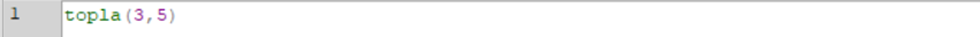

**Gerçek Zamanlı Tokenize ve Renklendirme**

[Uygulama videosunu izlemek için tıklayın!](https://youtu.be/8P-NLqN5gmg)

Python Tkinter ile Etkileşimli Bir Arayüz Tasarımı

1.  **Özet**

Bu çalışma, Bursa Teknik Üniversitesi Programlama Dilleri dersi
kapsamında verilen dönem ödevi için geliştirilmiştir. Projenin amacı,
kullanıcı tarafından arayüz üzerinden anlık olarak girilen Python
kodunun tokenlerine ayrılıp (yani anlamlı parçalara ayrılması)
sözdizimsel analizi yapılması ve bu tokenlerin türlerine göre gerçek
zamanlı olarak renklendirilmesidir. Proje Python dili üzerinden
geliştirilmiş olup temel arayüz kütüphanesi olan Tkinter dışında hiçbir
hazır kütüphane kullanılmamıştır. Proje Python dilinde gerekli olan çoğu
grameri kapsıyor olsa da kapsamadığı gramerler bulunmaktadır.

2.  **Projenin amacı ve katkıları**

Proje, bir metin editörü gibi çalışmakta olup kullanıcıya bir IDE
ortamında kodluyormuş hissi vermektedir. Klasik derleyici yapısının ilk
aşamaları olan lexical ve sözdizimsel syntax analiz süreçlerinin
sadeleştirilmiş bir versiyonunu, etkileşimli bir grafik arayüz üzerinden
uygulamalı olarak göstermektedir.

Kullanıcının elle yazdığı kodu karakter karakter tarayarak her bir kod
parçasını (token) tanımlamakta ve bu parçaları analiz ederek hangi
kategoriye ait olduğunu belirlenmektedir. Tanınan token türleri örneğin
rezerve kelimeler (keyword), sayılar, mantıksal ve matematiksel
operatörler, stringler, parantezler, boolean ifadeler olabilir. Bu
tokenlerin hepsi arayüzde renklendirilerek kullanıcıya anında görsel
geri bildirim sağlanmaktadır. Böylece kullanıcı, kodun yapısını daha net
bir şekilde anlayabilir, olası hataları hızlıca fark edebilir ve yazdığı
kodun gramer açısından geçerliliğini test edebilir.

3.  **Yöntem**

    1.  **Lexical Analyzer**

> Bu projede sözcüksel çözümleyici, \"State Diagram & Program
> Implementation\" yöntemine dayanmaktadır. Yani, her bir karakter elle
> kontrol edilerek durumlara göre token oluşturulmaktadır. re (regular
> expressions) kullanılmamıştır. Her karakter sırasıyla analiz edilmekte
> ve belirli bir kurala göre token\'lara ayrılmaktadır. Bu, duruma
> dayalı (state-based) bir kontrol yapısı ile programlama mantığı
> birleştirilerek uygulanmıştır.

2.  **Syntax Analyzer**

> Sözdizimsel çözümleme işlemi, Top-Down yaklaşımı ile yapılmaktadır. Bu
> yaklaşımda, dilin gramerine uygun olarak parse tree\'nin (ağaç
> yapısının) kökünden başlanarak dallara doğru inilir. Recursive descent
> parser yapısı kullanılmıştır. Her bir kural için ayrı bir fonksiyon
> tanımlanmış ve bu fonksiyonlar birbirini çağırarak girintili
> (recursive) bir yapı kurmuştur.

Proje, nesneye yönelik programlama ilkeleri esas alınarak
geliştirilmiştir. Kod yapısı, görevlerin sınıflar arasında ayrılarak
modüler ve sürdürülebilir hale getirilmesini hedeflemiştir. Bu
doğrultuda sistemin farklı bileşenlerini yöneten beş temel sınıf
oluşturulmuştur:

[*Token*, *Tokenizer*, *Error*, *Parser* ve *RealTimeIDE*.]{.mark}

Her sınıf kendi içinde belirli bir sorumluluğu yerine getirmekte,
böylece kodun okunabilirliği ve geliştirilebilirliği artırılmaktadır.

3.  **Token Class**

> Token sınıfı, sözcüksel analiz sürecinde tanımlanan her bir dil
> birimini temsil eder. Her token; türü (type), değeri (value) ve konumu
> (line) gibi bilgilerle birlikte tanımlanır. Bu sınıf, diğer
> bileşenlerin anlamlı ve yapılandırılmış veri ile çalışabilmesini
> sağlar.

4.  **Tokenizer Class**

> Tokenizer sınıfı, giriş olarak verilen metni analiz ederek
> karakterleri anlamlı parçalara (token\'lara) ayırır. re gibi hazır
> regular expression yapıları kullanılmadan, elle yazılmış kurallarla
> karakter karakter işlem yapılır. Bu sınıf, dilin söz dizimine uygun
> token\'ları üretirken, gerektiğinde hata durumlarını da belirler ve
> Error sınıfına bildirir.
>
> **Tokenizer.tokenize fonksiyonuna dahil edilen tokenler:**
>
> *[COMMENT]{.mark} :* \# karakteriyle başlayan ve satır sonuna kadar
> devam eden yorum satırlarını temsil eder. Bu token parse edilmez.
>
> *[KEYWORD]{.mark} :* Tanımlı anahtar kelimelerdir. if, else, while
> gibi özel anlamlı kelimeler bu kategoriye girer.
>
> *[BOOLEAN]{.mark} :* True ve False kelimeleri için kullanılır.
>
> *[IDENTIFIER]{.mark} :* Değişken, fonksiyon adı gibi kullanıcı tanımlı
> isimlerdir. Harf veya \_ karakteriyle başlar, devamında rakam da
> olabilir.
>
> *[NUMBER]{.mark} :* Sadece rakamlardan oluşan tam sayıları ifade eder.
>
> *[FLOAT]{.mark} :* Ondalıklı sayıları ifade eder.
>
> *[EQEQUAL (==), NOTEQUAL (!=), LESSEQUAL (\<=), LESS (\<),
> GREATEREQUAL (\>=),]{.mark} [GREATER (\>)]{.mark} :* Karşılaştırma
> operatörleri
>
> *[PLUS (+), MINUS (-), MULTIPLY (\*), DIVIDE (/), EQUALS (=)]{.mark}:*
> Aritmetik operatörler
>
> *[LPAREN ((), RPAREN ()), LBRACKET (\[), RBRACKET (\]), COLON (:),
> COMMA (,)]{.mark} :* Parentez, virgül vs. ifadeler.
>
> *[STRING]{.mark} :* Çift tırnak içine alınmış metinleri temsil eder.
>
> *[NEWLINE]{.mark} :* Yeni satır karakterini (\n) temsil eder. Satır
> satır analiz sağlar.

5.  **Error Class**

> Error sınıfı, sistemin çalışması sırasında oluşabilecek hataları
> yönetmek üzere tasarlanmıştır. Tokenizer ya da Parser tarafından
> tespit edilen hatalar bu sınıf aracılığıyla detaylı biçimde
> raporlanır. Hata mesajlarında ilgili satır bilgileri verilerek
> kullanıcıya doğru yönlendirme sağlanır.

6.  **Parser Class**

> Parser sınıfı, Tokenizer tarafından üretilen token listesini
> kullanarak, dilin gramerine uygun bir sözdizimsel analiz
> gerçekleştirir. Recursive descent (Top-Down) yaklaşımı ile çalışır.
> Her gramer kuralı için ayrı bir metod tanımlanmış ve bu metodlar
> birbiriyle hiyerarşik olarak ilişkilenmiştir. Bu yapı, dilin
> kurallarına uygun bir parse tree oluşturmayı hedefler.
>
> Bu kısımda gramer kuralları ve yazılan fonksiyonlar hakkında
> açıklamalar verilmiştir ve gramer formatları gösterilmiştir. :
>
> **COMMENT**
>
> \# karakteri ile başlayan ve satır sonuna kadar devam eden yorum
> satırlarıdır. Parser tarafından atlanır, işlenmez.
>
> 
>
> **statement_list fonksiyonu**
>
> Birden fazla ifadeyi işlemek için yazılmıştır. *IDENTIFIER*,
> *KEYWORD*, *NEWLINE* ile başlayabilir. *return* kelimesi ile
> karşılaşılırsa liste sona erdirilir.
>
> **statement**
>
> Bir ifadenin ne olduğunu belirler. Tanımsız bir ifade varsa hata
> verir.
>
> **assignment**
>
> Bir değişkene değer atar. Bu değer string, float, number vs. olabilir.
>
> 
>
> **if_statement**
>
> Koşullu ifade.
>
> 
>
> **while_statement**
>
> Koşullu döngü yapısı.
>
> 
>
> **for_statement**
>
> For döngüsü. Python dilindeki gibi liste iterasyonu ve range desteği
> sağlanmaktadır.
>
> 
>
> **switch_statement**
>
> Python'da olmayan ve ekstra olarak eklenen switch yapısı. Python
> dilinin bir eksiği olarak değerlendirildiği için eklendi.
>
> 
>
> **def_statement**
>
> Fonksiyon tanımı.
>
> 
>
> **func_call_statement**
>
> Fonksiyon çağrısı.
>
> 
>
> **list_literal**
>
> Köşeli parantezlerle tanımlanmış liste yapısı.
>
> 
>
> **argument**
>
> Fonksiyonlara gönderilen argümanlardır. Şunlar olabilir:
>
> [NUMBER , FLOAT , STRING , BOOLEAN , IDENTIFIER]{.mark}
>
> **expression**
>
> Her türlü ifadeyi içerir. Genellikle aritmetik ya da karşılaştırma
> içerir. Yani [comparison_expression()]{.mark} fonksiyonuna
> yönlendirir.
>
> **comparison_expression**
>
> Karşılaştırma operatörleri içeren ifadeler.
>
> 
>
> **arith_expression, term ve factor**
>
> Temel aritmetik işlemler içindir. İşlem önceliği çarpma ve bölmededir.

7.  **RealTimeIDE Class**

> RealTimeIDE sınıfı, kullanıcı arayüzü ile diğer bileşenler arasındaki
> etkileşimi yönetir. Kullanıcıdan alınan kaynak kodu Tokenizer ve
> Parser bileşenlerine yönlendirir, sonuçları görsel olarak kullanıcıya
> sunar. Ayrıca hataları da kullanıcıya anlık olarak göstererek
> etkileşimli bir geliştirme ortamı sağlar. Her token için farklı bir
> renk seçilmiştir.
>
> **IDE'nin genel görüntüsü :**
>
> 
>
> Parse edildikten sonra hatalı satırların gösterimi
>
> 

4.  **Sonuç**

Sonuç olarak, bu proje ile kullanıcıdan alınan Python kodlarının
otomatik olarak analiz edilip, temel sözdizimi kurallarına göre
renklendirilmesi sağlanmıştır. Gerçek zamanlı geri bildirim veren bu
yapı sadece görsel anlamda kodu okunabilir kılmakla kalmamış, aynı
zamanda hatalı yazımları ayırt edebilme açısından da kullanıcıya destek
sunmuştur.

Nesneye yönelik yapısı sayesinde geliştirilmeye açık olan bu projen
detaylı gramer kurallarını içermiyor olsa da kolay bir şekilde
geliştirilebilir.

Bu proje, sözdizimi renklendirme gibi basit görünen ancak geliştirici
deneyimini büyük ölçüde etkileyen bir konunun ardındaki temel yapıyı
anlamak adına önemli bir uygulama olarak değerlendirilmiştir.

> Efekan Aksoy
